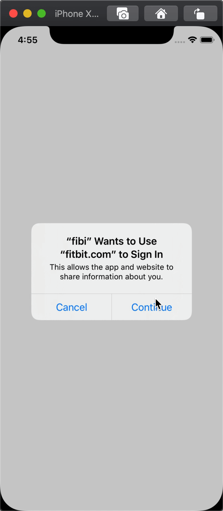
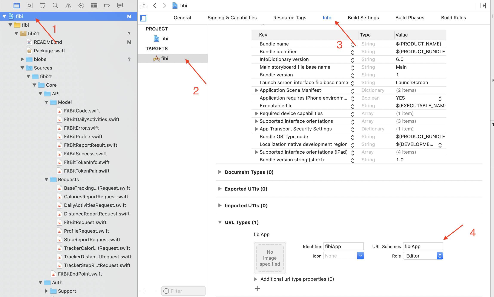

## fibi2t

> A tiny library for using FitBit web API. This lib created to speed up development process for those projects who are using the Fitbit API with iOS Swift, lib also provide an easy way for authenticating via OAuth and making a simple API call(s).


<p align="left">
  
  
  </a>
  <a href="https://github.com/icon-project/ICONKit" target="_blank">
    
</p>


<p align="center">
  
</p>


[Read More About the Fitbit API](https://dev.fitbit.com/docs/)

## Features

- Support Swift 5+ 🎉
- Support iOS
- Support Swift Package Manager

### Project structure

- Sources: contains source files
	- Core: core of the lib - main components
		- API: main components for API calls
			- Model
			- Requests
		- Auth: authorizatuion logic
			- Support: types for helping performing Auth
		- Session: Ready to use calls
	- Support: support files for configuring and executing API
- Test: test should be there, butnot yet 😩

## Installation

Currently supports only Swift Package, to install SP just follow [this tutorial](https://developer.apple.com/documentation/xcode/adding_package_dependencies_to_your_app)

#### Quick steps:

Swift Package Manager is now integrated into Xcode 11. You can add package by 

- going to "File"->"Swift Packages"->"Add Package Dependency..." 
- paste the repository's URL into the field above
- click "next" 

Xcode will walk you through the rest of the steps. 

[You can learn more at this WWDC talk.](https://developer.apple.com/videos/play/wwdc2019/408).


## Usage

### Create an app

Create an app by following [Fitbit App Config](https://dev.fitbit.com/apps/new). 


Later on, u shoud use `FitBitConfig` type created using this values like:

``` Swift

let config = FitBitConfig.authGrantFlowConfig(clientId: "<CLIENT_ID>",
                   clientSecret: "<CLIENT_SECRET>",
                   redirectScheme: "<SCHEME>", // note - with "://"
                   prompt: <PROMT MESSAGE>)

// u can use other params as well
```

using `FitBitConfig` u also shoud specify `scopes` with whuich u would like to work.

> Scope - data your app will be accessing from people's Fitbit accounts

By default `FitBitConfig` requests all scopes, but you may choosewhich one u need.

[more about OAuth Scopes](https://dev.fitbit.com/docs/oauth2/)


You also should add redirect URI so your app can responds to. This needs to be done as mentioned in config and in the appusing`xCode`. 
> Note that in the URL Types: scheme don't put in the `://` of your redirect uri.

[more about iOS URL Schemas](https://developer.apple.com/library/content/documentation/iPhone/Conceptual/iPhoneOSProgrammingGuide/Inter-AppCommunication/Inter-AppCommunication.html#//apple_ref/doc/uid/TP40007072-CH6-SW1)



Next - create `FitBitAPI` object - entry point for any actions related to `FitBit`.

``` Swift
var fibi2t: FitBitAPI //retain somewhere

// create with config
fibi2t = FitBitAPI(config)
```

> Note - `access_token` and `refresh_token` are handled automatically.If u wouldlike to handle them manually - provide `FitBitTokenProvidable` object for `FitBitAPI ` during `init` process

You are DONE ✅. Now u are ready to auth and create any requests.

### Auth

To Auth user all u need to do - just call appropriate auth functions:

``` Swift
 fibi2t.auth { [weak self] (result) in
      switch result {
        case .success(let code):
          self?.fibi2t.exchangeCodeForToken(code: code) { (excahngeResult) in
            switch excahngeResult {
              case .success(let tokenInfo):
                print("success in get token\n \(tokenInfo)")
				   // call any other requests u like
              case .failure(let tokenError):
                print(tokenError)
            }
        }
        case .failure(let error):
          print(error)
      }
    }
  }
```
 
 Also, lib provide few support functions related to auth:
 
 - refresh-token request (by default done automatically)
 
``` swift
   func refreshToken(_ tokenInfo: FitBitTokenPair) {
    self.fibi2t.refreshToken(tokenInfo) { (refreshTokenResult) in
      switch refreshTokenResult {
        case .success(let tokenInfo):
          print("success in refresh token\n \(tokenInfo)")
          self.requestProfile()
        case .failure(let tokenError):
          print(tokenError)
      }
    }
  }
```
 
 - revoke-token request
 
``` swift
  func revokeToken(_ tokenInfo: FitBitTokenPair) {
      self.fibi2t.revokeAllTokenAndSessions(tokenInfo) { (response) in
        switch response {
          case .success(let success):
            print("success in refresh token\n \(success)")
            self.requestProfile()
          case .failure(let err):
            print(err)
        }
    }
  }
```

### API call

Only few functions are ready to use (currently in progress)

to use them - just check `FitBitAPI+Requests.swift` file.

For example, to get user profile u can use next function:

```Swift
  func requestProfile() {
    fibi2t.fetchUserProfile { (requestResult) in
      switch requestResult {
        case .success(let object):
          print(object)
        case .failure(let error):
          print(error)
      }
    }
  }

```

[sample log output](./blobs/sample_log.txt)

> Note: all models has documentations and links for original docs, so feel free to check it if u have a questions, or create an [issue](https://github.com/kirillgorbushko/fitbitAPI/issues/new)


## TODO

- add tests
- add more requests
- add full support for both types of access (`code` and `token`)
- add possibility to sync data with `HealthKit`


## Author

[Kyryl Horbushko](https://www.linkedin.com/in/kyryl-horbushko-67936bb5/)

[drop me a line](mailto: kirill.ge@gmail.com?subject=[GitHub%20-%20Source%20fibi2t)


## Contributing/Issues/Questions

We would love you to contribute to **fibi2t**.
If you would like to contribute - just create a pull request.

Have a question or an issue about `fibi2t`? Create an [issue](https://github.com/kirillgorbushko/fitbitAPI/issues/new)!


## License

[MIT licensed.](LICENSE)
